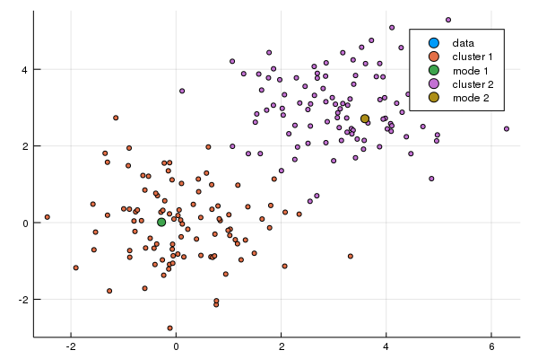

# DiscreteModalClustering.jl
A naive implementation of some discrete approximative modal clustering algorithm variants

<pre>
julia> import Plots

julia> Plots.gr()
Plots.GRBackend()

julia> include("DiscreteModalClustering.jl")
Main.DiscreteModalClustering

julia> data = hcat(randn(2,100), 3 .+ randn(2,100))
2×200 Array{Float64,2}:
 -0.492131  -0.115306  2.34308    1.78081   -0.28743   …  2.87752  2.97298  3.07812  3.0693   1.7247   1.53658
 -0.408142  -2.75199   0.220442  -0.134554   0.272212     2.63324  3.26081  2.8648   2.73812  2.93432  2.83526

julia> a = DiscreteModalClustering.maximum_distance_centrality_based_clustering(data, 30)
200×3 Array{Int64,2}:
  19   19   19
   1   19   19
  24   22   19
  42   19   19
  19   19   19
  19   19   19
  68   19   19
  19   19   19
  21   19   19
   5   19   19
  19   19   19
  68   19   19
  22   19   19
   ⋮
 195  185  185
 195  185  185
  44   19   19
 185  185  185
 124  185  185
 195  185  185
 185  185  185
 185  185  185
 185  185  185
 185  185  185
 195  185  185
 195  185  185

julia> DiscreteModalClustering.plot_data_and_clustering(data, a[:,3])

julia> Plots.savefig("plot.png")

julia>

</pre>

